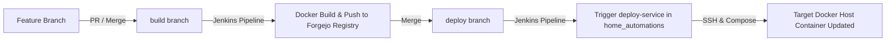

# AI Agent Guide: Operating & Developing `bgtags`

Welcome to the **`bgtags`** repository. This document serves as the canonical technical guide and operating manual for AI agents (and human developers) adding board games, rules, player aids, expansions, companion materials, and maintaining the system.

---

## 1. System Overview & Core Capabilities

`bgtags` is a self-hosted web service that bridges physical board games with digital rules and companion resources:
- **Physical QR Code Stickers (`/stickers`)**: Generates printable Avery-style sheets of stickers formatted with game title, box art, min/max/best player count, complexity rating, and a direct QR code linking to the game's rule hub.
- **Dual-Mode Rules Hub (`/games/{id}/rules`)**:
  - **Single Rule**: If a game only has 1 primary document, navigating to `/games/{id}/rules` directly opens or downloads the PDF.
  - **Multi-Rule / Companion Hub**: If a game has multiple documents (e.g. core rules, expansions, player aids, teaching scripts, FAQs), it presents an interactive, mobile-responsive landing page categorized into:
    - 📖 **Core Rules**
    - 🧩 **Expansions**
    - 📋 **Player Aids & References**
    - ❓ **FAQs & Errata**
- **OIDC Authentication & SSO**:
  - Integrated with **Authentik** (or any OpenID Connect provider) via standard authorization code flow (`/auth/login`, `/auth/callback`, `/auth/logout`).
  - Secure, HTTP-only, encrypted session cookies (`bgtags_session`).
- **Role-Based Access Control (RBAC)**:
  - **Public / Anonymous**: Public browsing of games, stickers, and rules (unless restricted by `USER_GROUP`).
  - **Standard User**: Authenticated via SSO; navbar displays user avatar and identity badge.
  - **Admin**: Users belonging to `ADMIN_GROUP` gain access to the **Admin Control Panel (`/admin`)**.
- **Admin Control Panel (`/admin`)**:
  - **Game Management**: Create, edit, and delete games directly from the browser with box art and PDF rulebook upload.
  - **Document Hub Management**: Add or remove secondary PDFs (expansions, player aids, references) per game.
  - **Live Backups & Disaster Recovery**: One-click SQLite snapshots (`VACUUM INTO`), snapshot download, and database restoration directly from the UI.
- **CI/CD Automation**: Dual-branch automated delivery via Jenkins and Forgejo container registry.

---

## 2. Infrastructure & Host Architecture

> [!NOTE]
> All infrastructure endpoints, server IPs, and SSH credentials are maintained privately in the `home_automations` repository. Never commit internal IPs or credentials to this repository.

| Component | Host / IP | Location / Path | Purpose |
| :--- | :--- | :--- | :--- |
| **bgtags Application** | `<docker-host>` | Docker container `bgtags` (`:8080`) | Go 1.22 + HTMX web application |
| **Live SQLite Database** | `<docker-host>` | `/app/data/bgtags.db` | Operational database |
| **Rules Storage** | `<storage-host>` | Rules volume mounted to `/app/rules/` | Persistent PDF storage |
| **Image Storage** | `<storage-host>` | Images volume mounted to `/app/img/` | Persistent box art |
| **Backup Storage** | `<storage-host>` | Backup volume mounted to `/app/backups/` | Timestamped SQLite snapshots |
| **Seed / Source of Truth** | Git Repo | `data/seed_games.json` | Repository-tracked seed data for fresh deployments |

---

## 3. Configuration & Environment Variables

The application is configured via environment variables (passed in Docker Compose or `.env`):

| Variable | Required | Default | Description |
| :--- | :---: | :--- | :--- |
| `PORT` | No | `8080` | Port for the HTTP web server |
| `BASE_URL` | No | `http://localhost:8080` | External base URL used for QR code generation and OIDC callbacks |
| `DB_PATH` | No | `data/bgtags.db` | Path to SQLite database file |
| `RULES_DIR` | No | `rules` | Path to persistent PDF rules directory |
| `IMG_DIR` | No | `img` | Path to persistent box art directory |
| `BACKUPS_DIR` | No | `backups` | Path to database backup snapshots directory |
| `SESSION_SECRET` | Yes (for SSO) | `secret-key-...` | 32+ byte key used to sign and encrypt session cookies |
| `OIDC_ISSUER_URL`| Yes (for SSO) | — | OIDC Issuer endpoint (e.g. `https://auth.example.com/application/o/bgtags/`) |
| `OIDC_CLIENT_ID` | Yes (for SSO) | — | OIDC Client ID registered in Authentik |
| `OIDC_CLIENT_SECRET` | Yes (for SSO) | — | OIDC Client Secret registered in Authentik |
| `OIDC_REDIRECT_URL`| Yes (for SSO) | — | Absolute OAuth callback URL (e.g. `https://bgtags.example.com/auth/callback`) |
| `ADMIN_GROUP` | No | `bgtags-admins` | Authentik group name required for `/admin` access |
| `USER_GROUP` / `OIDC_USERS_GROUP` | No | `""` (empty) | If set to `*` or `any`, any authenticated user in Authentik has reader access. If set to a group name, membership is enforced; if empty `""`, public access is enabled |

---

## 4. Database Schema & Data Models

The SQLite database consists of two primary tables:

### 4.1 `games` Table
Stores high-level game metadata:
```sql
CREATE TABLE IF NOT EXISTS games (
    id INTEGER PRIMARY KEY AUTOINCREMENT,
    name TEXT NOT NULL,
    url TEXT NOT NULL,          -- Primary PDF filename (e.g. "stationfall-reference-manual.pdf")
    image TEXT,                 -- Box art filename in img/ (e.g. "stationfall.png")
    min_players INTEGER,
    max_players INTEGER,
    best_players TEXT,          -- Community recommendation (e.g. "5-6", "4", "3-4")
    complexity REAL,            -- BGG average weight float 1.00-5.00 (e.g. 4.09)
    bgg_url TEXT,               -- Full BGG URL (e.g. "https://boardgamegeek.com/boardgame/316624/stationfall")
    parent_id INTEGER,          -- NULL for base games; points to base game ID for standalone expansions
    created_at DATETIME DEFAULT CURRENT_TIMESTAMP,
    updated_at DATETIME DEFAULT CURRENT_TIMESTAMP
);
```

### 4.2 `game_documents` Table
Stores all individual PDF files associated with a game:
```sql
CREATE TABLE IF NOT EXISTS game_documents (
    id INTEGER PRIMARY KEY AUTOINCREMENT,
    game_id INTEGER NOT NULL REFERENCES games(id) ON DELETE CASCADE,
    title TEXT NOT NULL,        -- Descriptive title (e.g. "Reference Manual", "Expedition Leaders Rules")
    category TEXT NOT NULL,     -- One of: 'core', 'expansion', 'reference', 'faq'
    filename TEXT NOT NULL,     -- Exact PDF filename stored in rules/
    is_primary INTEGER DEFAULT 0, -- 1 for main rulebook, 0 for secondary
    created_at DATETIME DEFAULT CURRENT_TIMESTAMP
);
```

---

## 5. Admin Control Panel Features (`/admin`)

The Admin Control Panel allows authorized administrators (members of `ADMIN_GROUP`) to manage the game collection and system health directly from the web interface without touching the database or terminal.

### 5.1 Games Management (`/admin`)
- **Add Game Modal**:
  - Input: Title, BGG ID or URL, player count range, best player count, and complexity.
  - File Uploads: Primary PDF rulebook and box art image (`.jpg`, `.png`).
  - Auto BGG Fetch: If a BGG ID/URL is entered and no image is uploaded, the server automatically downloads the high-res box art from BGG.
- **Delete Game**:
  - Permanently removes the game record and automatically cascades deletions to all associated `game_documents`.
- **Document Management Modal**:
  - View all attached documents categorized by Core, Expansion, Reference, and FAQ.
  - Upload additional PDFs directly to the game's companion hub.
  - Delete individual companion documents.

### 5.2 Backups & Disaster Recovery (`/admin?tab=backups`)
- **Create Snapshot**:
  - Executes a live, non-blocking SQLite snapshot (`VACUUM INTO`) saved to `/app/backups/bgtags_YYYYMMDD_HHMMSS.db`.
  - Computes file size and active game/document counts.
- **Download Backup**:
  - Directly download any `.db` snapshot for offsite storage.
- **Restore Snapshot**:
  - Replaces the active database with a chosen snapshot and safely resets database connections.

---

## 6. Ground Rules & Content Policies

1. **ENGLISH CONTENT ONLY**:
   - **MANDATORY**: Only download and store English rulebooks, guides, and player aids.
   - Do NOT upload German, French, Spanish, or other international editions unless explicitly requested.
2. **Naming Conventions**:
   - Rulebooks: `kebab-case.pdf` (e.g., `beyond-the-sun.pdf`, `beyond-the-sun-quick-start.pdf`).
   - Images: `kebab-case.jpg` or `kebab-case.png` (e.g., `beyond-the-sun.jpg`).
3. **Zero Internal Leakage Policy**:
   - Never commit private IP addresses (`10.0.0.x`), internal domain names (`*.home`, `*.local`), or host paths to Git. Keep network topology exclusively in `home_automations`.
4. **File Verification**:
   - Check file integrity (`file <filename>` or `pdfinfo <filename>`).
   - Verify extracted text contains English headings (`pdftotext <filename> - | head -n 30`).
5. **File Permissions**:
   - All files copied manually to the storage host must have read permissions for the container process (`chmod 666` or `chmod 644`). When uploaded via `/admin`, the application sets permissions automatically.

---

## 7. Workflows to Add a Game & Rules

There are two primary methods for adding games:

### Method A: Via Web Admin UI (Recommended)
1. Navigate to `/admin` in the browser while logged in as an admin.
2. Click **"+ Add Game"**.
3. Enter the game title, BGG ID/URL, player range, best player count, and complexity.
4. Upload the primary rulebook PDF and box art image.
5. Click **"Save Game"**. The server creates the records in SQLite and saves the files into `/rules/` and `/img/`.
6. To add companion guides or expansions, click the document count badge next to the game, choose a category (*Expansion*, *Reference*, *FAQ*), and upload the companion PDF.
7. Export/update `data/seed_games.json` to keep git tracked seed data in parity.

### Method B: Headless / Scripted CLI Workflow

#### Step 1: Select Game from Backlog
- Consult `GAMES_TODO.md` (ordered by complexity descending) or `games_todo.txt`.

#### Step 2: Download Rules & Companion Documents
- **Publisher Site**:
  ```bash
  curl -sL "https://publisher.com/rules.pdf" -o /tmp/game-rules.pdf
  ```
- **BoardGameGeek File Page**:
  Use the authenticated Chrome CDP script (`scripts/bgg_cdp_downloader.mjs`):
  ```bash
  node scripts/bgg_cdp_downloader.mjs "<bgg_file_page_url>" "/tmp/target-filename.pdf"
  ```

#### Step 3: Download Box Art
- Fetch high-res cover image from BGG:
  ```bash
  curl -sL "<bgg_image_url>" -o /tmp/game-title.jpg
  ```

#### Step 4: Transfer Assets to Persistent Storage
Transfer files to the storage host (refer to `home_automations` for host destination):
```bash
scp -O /tmp/*.pdf <storage-host>:/volume1/docker/bgtags/rules/
scp -O /tmp/*.jpg <storage-host>:/volume1/docker/bgtags/img/
ssh <storage-host> "chmod 666 /volume1/docker/bgtags/rules/*.pdf /volume1/docker/bgtags/img/*"
```

#### Step 5: Update the Database
Insert the game and documents into SQLite:
```python
import sqlite3

conn = sqlite3.connect("/path/to/bgtags.db")
cur = conn.cursor()

cur.execute("""
    INSERT INTO games (name, url, image, min_players, max_players, best_players, complexity, bgg_url)
    VALUES (?, ?, ?, ?, ?, ?, ?, ?)
    ON CONFLICT(id) DO UPDATE SET
        url=excluded.url, image=excluded.image, min_players=excluded.min_players,
        max_players=excluded.max_players, best_players=excluded.best_players,
        complexity=excluded.complexity, bgg_url=excluded.bgg_url
""", ("Game Title", "game-rules.pdf", "game-title.jpg", 1, 4, "3", 3.75, "https://boardgamegeek.com/boardgame/..."))

game_id = cur.lastrowid or cur.execute("SELECT id FROM games WHERE name = ?", ("Game Title",)).fetchone()[0]

docs = [
    ("Core Rulebook", "core", "game-rules.pdf", 1),
    ("Quick Reference Sheet", "reference", "game-quick-ref.pdf", 0),
]
cur.execute("DELETE FROM game_documents WHERE game_id = ?", (game_id,))
for title, category, filename, is_primary in docs:
    cur.execute("""
        INSERT INTO game_documents (game_id, title, category, filename, is_primary)
        VALUES (?, ?, ?, ?, ?)
    """, (game_id, title, category, filename, is_primary))

conn.commit()
conn.close()
```

#### Step 6: Update Seed File (`data/seed_games.json`)
Always update `data/seed_games.json` in Git to keep development and production in parity:
```json
{
  "name": "Game Title",
  "url": "game-rules.pdf",
  "image": "game-title.jpg",
  "min_players": 1,
  "max_players": 4,
  "best_players": "3",
  "complexity": 3.75,
  "bgg_url": "https://boardgamegeek.com/boardgame/...",
  "documents": [
    {
      "title": "Core Rulebook",
      "category": "core",
      "filename": "game-rules.pdf",
      "is_primary": true
    },
    {
      "title": "Quick Reference Sheet",
      "category": "reference",
      "filename": "game-quick-ref.pdf",
      "is_primary": false
    }
  ]
}
```

#### Step 7: Update Backlog & Synchronize
Regenerate `GAMES_TODO.md` and `games_todo.txt`:
```bash
node scripts/extract_remaining_games.mjs
```

---

## 8. Multi-Branch CI/CD Deployment Architecture

`bgtags` uses a standardized, dual-branch CI/CD pipeline integrated with Jenkins and Forgejo:



- **`build` branch**: Merging code triggers Jenkins to compile the Go binary, build the Docker container image, tag it with the commit SHA and `:latest`, and push to Forgejo Container Registry (`forgejo.cklein.us`).
- **`deploy` branch**: Merging code triggers Jenkins to invoke the downstream `deploy-service` pipeline in `home_automations`, which pulls the updated image and recreates the container on the target Docker host.

---

## 9. Helper Scripts Reference

All operational automation is located under `scripts/`:

| Script | Purpose |
| :--- | :--- |
| `scripts/extract_remaining_games.mjs` | Pulls BGG collection via CDP, compares against `data/seed_games.json`, and generates `GAMES_TODO.md`, `games_todo.txt`, and `remaining_games_by_complexity.json` |
| `scripts/bgg_cdp_downloader.mjs` | Downloads rulebooks from protected BGG file pages via authenticated Chrome CDP session on port 9222 |
| `scripts/fetch_bgg_collection.py` | Python fallback collection parser |

---

## 10. Common Gotchas & Troubleshooting

1. **Cloudflare Block / Turnstile on BGG**:
   - Do NOT attempt pure `curl` or unauthenticated scrapers against BGG file download endpoints.
   - Use `scripts/bgg_cdp_downloader.mjs` which uses the authenticated Chrome session on port `9222`.
2. **S3 Pre-Signed URL Expiration**:
   - BGG's AWS S3 download links expire in 120 seconds. The CDP script captures `Network.requestWillBeSent` and streams the file immediately.
3. **HTTP 500 or Empty Rules in Browser**:
   - Check file permissions on the storage volume. Container processes need read access (`chmod 666` or `chmod 644`).
4. **OIDC Redirect Mismatch**:
   - Ensure `OIDC_REDIRECT_URL` in the environment exactly matches the Redirect URI configured in the Authentik Provider.
5. **Authentik Admin Group**:
   - Verify the logged-in user is a member of the group specified in `ADMIN_GROUP` (e.g. `bgtags-admins`). In Authentik, ensure the default group property mapping is enabled on the OIDC provider.
